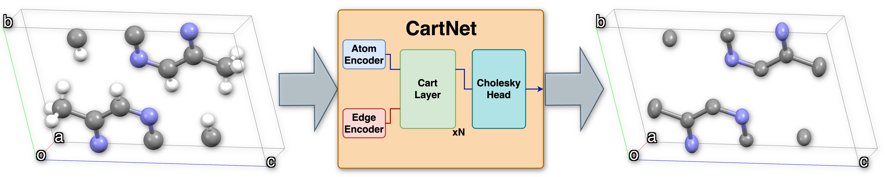

# CartNet Streamlit Web App



### CartNet online demo available at: [CartNet Web App](https://cartnet-adp-estimation.streamlit.app)


CartNet is a graph neural network specifically designed for predicting Anisotropic Displacement Parameters (ADPs) in crystal structures. The model has been trained on over 220,000 molecular crystal structures from the Cambridge Structural Database (CSD), making it highly accurate and robust for ADP prediction tasks. CartNet addresses the computational challenges of traditional methods by encoding the full 3D geometry of atomic structures into a Cartesian reference frame, bypassing the need for unit cell encoding. The model incorporates innovative features, including a neighbour equalization technique to enhance interaction detection and a Cholesky-based output layer to ensure valid ADP predictions. Additionally, it introduces a rotational SO(3) data augmentation technique to improve generalization across different crystal structure orientations, making the model highly efficient and accurate in predicting ADPs while significantly reducing computational costs.

This repository contains a web application based on the official implementation of CartNet, which can be found at [imatge-upc/CartNet](https://github.com/imatge-upc/CartNet).

⚠️ **Warning**: The online web application can only process systems wiht less than 300 atoms in the unit cell. For large systems, please use the local application.

## Local Application
### Installation of the local application

To set up the local application, you need to install the dependencies listed in `requirements.txt`. You can do this by running the following command:

```bash
pip install -r requirements.txt
```

### Usage

You can make predictions directly from Python using the `predict.py` script.

The script takes two arguments:
1. `input_file`: Path to the input CIF file
2. `output_file`: Path where you want to save the processed CIF file

Example usage:

```bash
python predict.py input.cif output.cif
```

Or if you prefer, you can use the browser app in your local machine by running:

```bash
streamlit run main_local.py
```

Example usage:

```bash
python main_local.py input.cif output.cif
```
## How to cite

If you use CartNet in your research, please cite our paper:

```bibtex
@article{your_paper_citation,
title={Title of the Paper},
author={Author1 and Author2 and Author3},
journal={Journal Name},
year={2023},
volume={XX},
number={YY},
pages={ZZZ}
}
```
